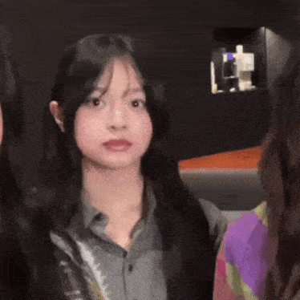

  

<!--  -->
<table style="border:0;">
  <tr>
    <td style="border:0;">
      <h3>
         About Me
      </h3>
      

        I am a Computer Science Student actively expanding my skills and knowledge in the Software Engineering field. I am passionate about learning and building creative, innovative, and functional products transforming ideas into tangible end-results with strong design taste.
      

    </td>
    <td width="40%" align="center" valign="middle" style="border:0;">
      
    </td>
  </tr>
</table>

<h3>
         Quick Facts
      </h3>
      <ul>
        <li>🌱 I'm currently learning Typescript and Reac.</li>
        <li>💼 Open for Software Engineer Internship and Freelance opportunities.</li>
        <li>🎨 When I’m not debugging, I’m usually doing visual design, editing videos/clips, or chilling with good music.</li>
        <li>📫 Feel free to drop a message at <a href="mailto:bahtiarrifaii06@gmail.com">bahtiarrifaii06@gmail.com</a>.</li>
      </ul>
